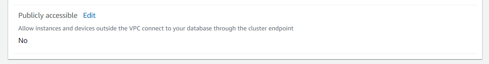
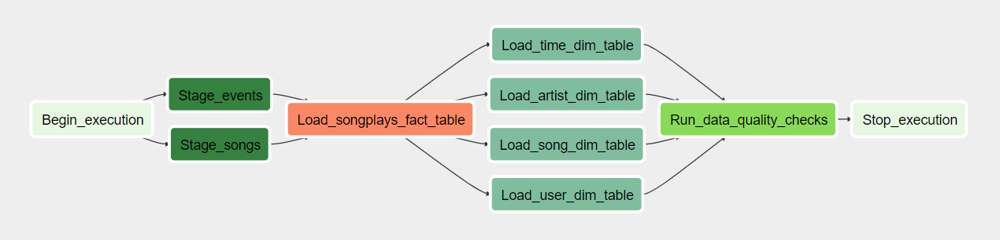

# Sparkify Analytics - Udacity Project 5

<p align="center">
  
</p>

This time, Sparkify has decided that it is time to introduce more automation and monitoring to their data warehouse ETL pipelines and come to the conclusion that the best tool to achieve this is Apache Airflow.

## Prerequisites

You'll need to [create an AWS account](https://aws.amazon.com/pt/premiumsupport/knowledge-center/create-and-activate-aws-account/), to create an Redshift Cluster.

*Attention: You should be charged for the services that you use, check the [AWS pricing](https://aws.amazon.com/pt/pricing/) in order to not be surprised while creating your environment.*

[Create an IAM user](https://docs.aws.amazon.com/directoryservice/latest/admin-guide/setting_up_create_iam_user.html) (use a name of your choice) and save its [access key and secret key](https://docs.aws.amazon.com/IAM/latest/UserGuide/id_credentials_access-keys.html) credentials (do not share it).

Also, you need Airflow running.<br>
We suppose that you are familiar with its installation and configuration.

## Datasets

You'll be working with two datasets that reside in S3, that was provided by Udacity:

* Song data: `s3://udacity-dend/song_data`
* Log Data: `s3://udacity-dend/log_data`

The star schema was created following the same structure of [Sparkify - Project 1](https://github.com/brunorochax/udacity_project1).

## Redshift Cluster

Log into your AWS Account and go to Amazon Redshift service page. Create a new cluster with the size that you want and give it a identifier.

Set a database name, a master user and password. Save it, you'll need to configure your Redshift connection with, on Airflow.

After cluster creation, go to properties panel and change publicly accessbile to "yes".

<p align="center">
  
</p>

Create all tables described on create_tables.sql, that is inside Airflow folder, on this repository. You can do it on Redshift Editor interface.

## Running Ingestion Dag

Clone this repository on your environment and put dags and plugins folders inside you Airflow path installation.

```
$ git clone git@github.com:brunorochax/udacity_dataengineer_project5.git
```

This is our dag, it will import import stage tables, load fact table, load dimension tables on Redshift and also, apply a task for data quality, that will count rows of dimension tables.

<p align="center">
  
</p>

Just turn on this dag on Airflow UI and wait for it execution.

## Authors 

This project and data were created and provisioned by udacity.com on Data Engineering Nanodegree.